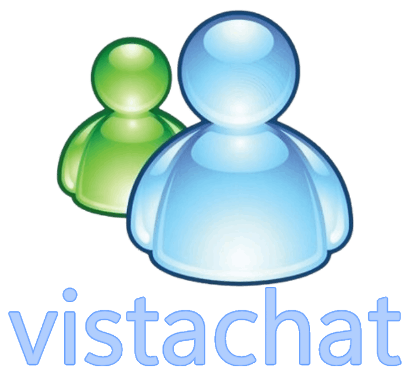

Vistachat is a chatroom website, with the design heavily inspired by Windows Vista, literally the best windows version ever

## Features

- **Real-Time Talking**: Be able to talk in live time, powered by Socket.io.
- uhh

## Getting Started

To set up your own copy of Vistachat, follow these steps:

1. **Fork the Repository**: Click the "Fork" button on this repository.
   
2. **Host the Application**: Choose a hosting service that supports Node.js, or just click one of the buttons below
   
3. **Configure Build Settings**:
   - Set the output directory to `/public`.
   - Set the build command to:
     ```
     node index.js
     ```

After doing these steps, you're all ready to use vistachat! :D

## Credits

- **Developer**: [Szvy](https://szvy.win/) - really cool developer that made this.
- **Libraries Used**: 
  - [Socket.IO](https://socket.io/) - really cool nodejs library that lets you have live time chatting.

## Contributing

If you want to contribute, just make a pull request.

## License

This project is licensed under the [MIT License](LICENSE).
